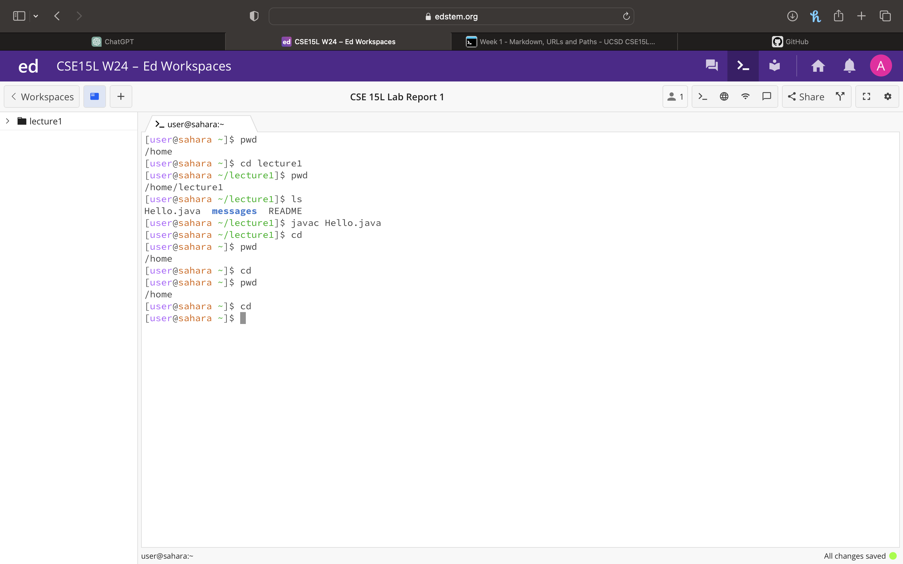

# Lab Report 1
## Command `cd`
### No Arguments 

* Working Directory: `/home`
* Running `cd` with no arguments takes you to your home directory
* the output is not an error
### Directory as an Argument

* Working Directory: `/home`
* This command changes the working directory to the lecture1 directory. It navigates the user into the specified directory
* The output is not an error
### File as an Argument

* Working Directory:`/home/lecture1` messages
* Using `cd` with a file as an argument results in an error. `cd` is designed for changing directories, not files
* the output is an error because the argument for `cd` is supposed to be a directory
## Command `ls`
### No Arguments

* Working Directory: `/home/lecture1`
* Running `ls` with no arguments lists the files and directories in the current directory which is lecture1
* the output is not an error
### Directory as an Argument

* Working Directory:`/home/lecture1`
* Running `ls` with the argument `messages` lists the directories and files in the current directory which is lecture1
* the output is not an error
### File as an Argument

* Working Directory:`/home/lecture1/messages`
* Running `ls` with a file argument results in the specified file being listed
* the output is not an error
## Command `cat`
### No Arguments

* Working Directory: `/home`
* Using `cat` with no arguments results in an error. `cat` expects a file as an argument to concatenate and display its content. this is why there is no output
* there is an error because `cat` expects a file as an argument.
### Directory as an Argument

* Working Directory:`/home`
* Attempting to use 'cat' on a directory leads to an error
* there is an error because it is not meant to use directory as an argument
### File as an Argument

* Working Directory:`/home/lecture1/messages`
* Displays the contents of the file
* the output is not an error
