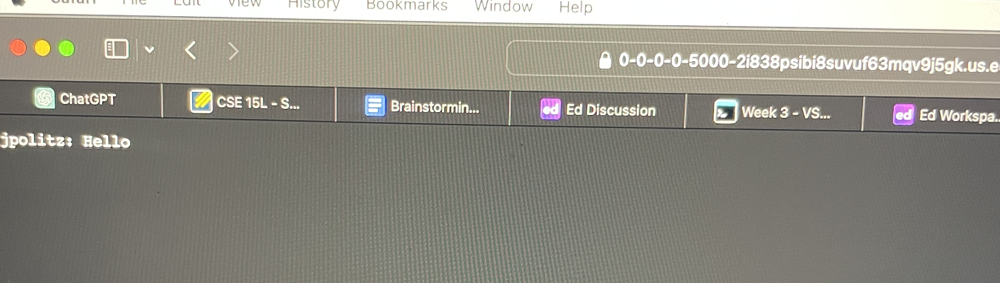
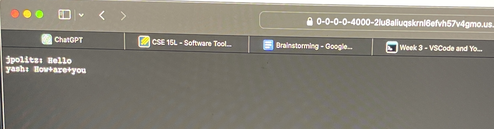

# Lab Report 2
## Part 1
### Code for ChatServer

### ScreenShot 1

* The method in my code that is called is `ChatHandler.handle(HttpExchange exchange)`.
* The most relevent arguement to this method is `HttpExchange exchange` This represents the HTTP exchange between the server and the client It contains the information about the request and allows the user to send a response. Some relevent fields and their values are `URI uri = exchange.getRequestURI();` this retrieves the URI of the incoming request, `chatMessages` this has a list of chat messages in the server class,and `user`(jpolitz) and `message`(Hello) which are obtained and decoded from the URI.
* The `chatMessages` list  is changed as it gets updated with the new message and reformated based on the request `/add-message?s=Hello&user=jpolitz`. The reformatted message is   `jpolitz: Hello`. This allows this newly formatted chat message to be sent back to the client.
### ScreenShot 2
 
* The method in my code that is called is `ChatHandler.handle(HttpExchange exchange)`.
* The most relevent arguement to this method is `HttpExchange exchange` This represents the HTTP exchange between the server and the client It contains the information about the request and allows the user to send a response. Some relevent fields and their values are `URI uri = exchange.getRequestURI();` this retrieves the URI of the incoming request, `chatMessages` this has a list of chat messages in the server class,and `user`(yash) and `message`(How are you) which are obtained and decoded from the URI.
* The `chatMessages` list  is changed as it gets updated with the new message and reformated based on the requestt `/add-message?s=How%20are%20you&user=yash` The reformatted message is   `jpolitz: Hello\nyash: How are you\n`. This allows this newly formatted chat message to be sent back to the client.
## Part 2
### The absolute path to the private key for SSH key for logging into `ieng6`

### The absolute path to the public key for SSH key for logging into `ieng6`

### Terminal interaction logging into ieng6 account without being asked for a password.

## Part 3
Something that I learnt in week 2 that I did not know before was how to remotely log into a computer in the CSE basement from my laptop. I learnt how to use the `ssh` command so that I can log into a computer in the CSE building's basement. Additionally through this I learnt how to build and run a server through a remote computer and that I can access this server from more than one computer or browser. 
  
