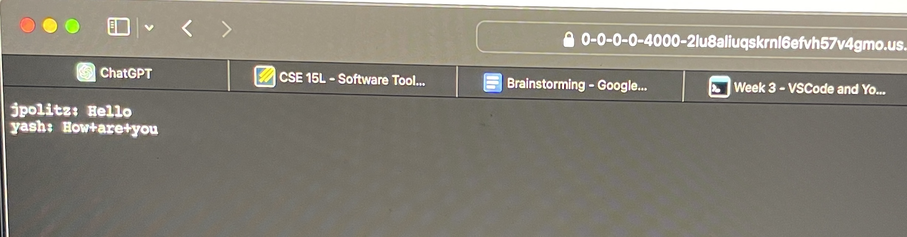

# Lab Report 5
## Part 1
### Student Post
 
### TA Response
 
### Fixed Output
 
The issue was a syntax error. There was a missing `then` after the `if` statement. While reviewing the script, I noticed that I had missed adding the `then` after the `if` condition. Here's the problematic section of code:
   `if [ $var -eq 1 ]
   echo "Variable is 1"
   fi`
  This is the fixed code:
  `if [ $var -eq 1 ]; then
  echo "Variable is 1"
  fi`
### Contents
The file and directory structure needed was:
  project_folder/
     script.sh
     data/
      data.csv
The content of script.sh before fixing bug 
  `if [ $var -eq 1 ]
   echo "Variable is 1"
   fi`
The content of data.csv:
  Name, Age, Gender
  John, 25, Male
  Jane, 30, Female
The command that I ran to trigger the bug was `bash script.sh`.
In order to fix the bug in `script.sh` one needs to add `then` after the `if` statement. This follows the proper syntax for an `if` statement in scripting. 
## Part 2
### Something interesting that I learned about during the secodn half of the quarter was `vim`. I didn't know before that there are text editors that are built into `Linux`. I found this really useful because it means that one does not need to use a platform such as VSCode to view and edit files and everything can be done from the terminal. I also thought it was really cool that there were so many keyboard shortcuts for `vim`. Specifically I thought the fact that one can search and select all of the iterations of s certain phrase was really useful for editing purposes. 
