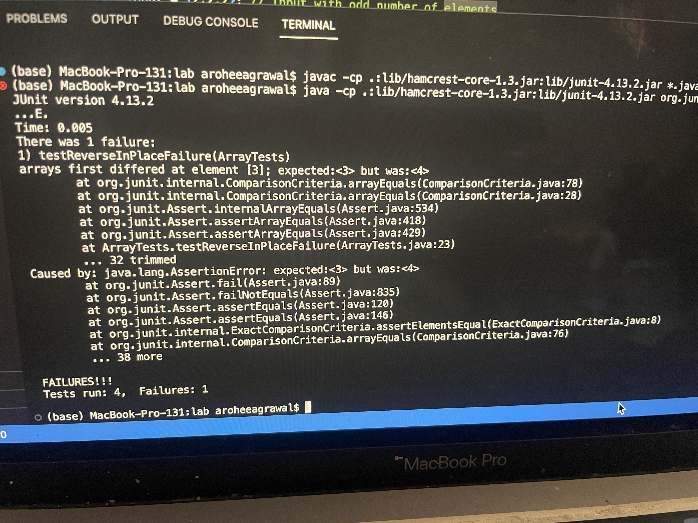

# LabReport3
## Part 1
### Failure inducing input
```
@Test 
public void testReverseInPlaceFailure() {
  int[] input = {1, 2, 3, 4, 5, 6}; 
  ArrayExamples.reverseInPlace(input);
  assertArrayEquals(new int[]{6, 5, 4, 3, 2, 1}, input);
}
```
### Non failure inducing input
```
@Test 
public void testReverseInPlaceFailure() {
  int[] input = {2,2,2}; 
  ArrayExamples.reverseInPlace(input);
  assertArrayEquals(new int[]{2,2,2}, input); 
}
```
### Symptom

### bug and solution 
```
arr[i] = arr[arr.length - i - 1];
```
```
temp = arr[i];
arr[i] = arr[arr.length - i - 1];
arr[arr.length - i - 1] = temp;
```
This fixes the solution because in the initial code the array was getting overwritten as the elements were being assigned new positions in the now reversed array. So they were being assigned the wrong position. In the fixed code there is a temporary variable that holds the value of the current element being swicthed. This ensures that each elemnt can be placed in the correct reversed position.

## Part 2 - Grep
### `-r` This allows `grep` to search recursively through directories. It's useful when you want to search for a pattern or word not just in one file but throughout all the files within a directory and its subdirectories.
```
grep -r "biology" /Users/aroheeagrawal/docsearch/technical/biomed
```
This searches recursivley through the biomed directory for all files that contain the phrase biology.
```
grep -r "current" /Users/aroheeagrawal/docsearch/technical
```
This recursivley searches through the technical directory and all of its subdirectories for all the files that contain the phrase current.
### `-i` This allows `grep` to search while ignoring case distinctions during the search. It's useful when you want to perform a case-insensitive search.
```
grep -i "law" og98019.txt
```
This ignores case distinctions and searches for the "law" through the file og98019.txt.
```
grep -ri "judge" /Users/aroheeagrawal/docsearch/technical/government
```
This searches through the government directory for all files that have "judge" while ignoring case distinctions.
### `-c` This  displays the count of lines that match the search parameter , rather than the actual matching lines. It's useful when you want to know the total number of matches.
```
grep -c "law" og98019.txt
```
This counts the number of lines in the file that contains "law".
```
grep -ci "law" og98019.txt
```
This counts the number of lines in the file that contains "law" being case insensitive.
### `-l` This displays the names of file that contain at least one line that contains the search parameter, rather than the actual matching lines. It's useful when you want to know which files contain the search parameter. 
```
grep -l "bio" /Users/aroheeagrawal/docsearch/technical/*
```
This provides the names of the directories that contain "bio" in them.
```
grep -rl "bio" /Users/aroheeagrawal/docsearch/technical/biomed
```
This searches recursivley through the biomed directory and displays the names of all the files that contain "bio" in them. 
